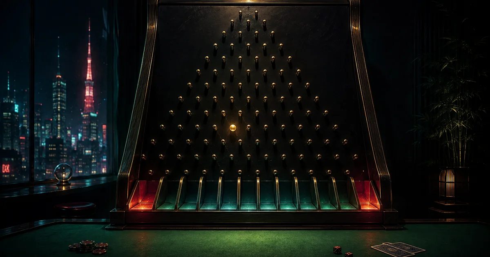
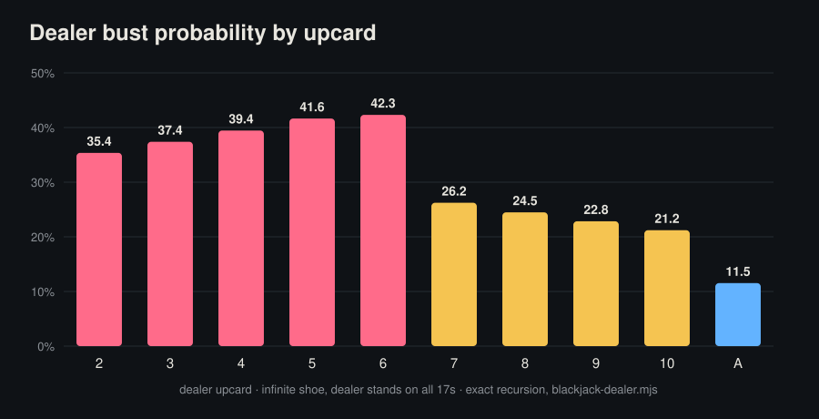
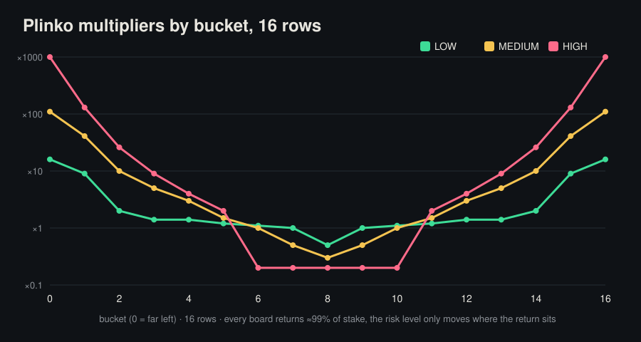
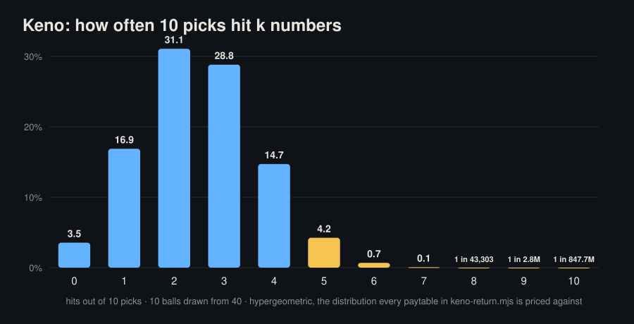

# Betkyo odds derivations



The scripts that turn the engine's published tables into the return figures quoted in the [Betkyo Journal](https://betkyo.com/en/blog/). No dependencies; each script prints the numbers the corresponding article prints.

| Script | Computes | Article |
|---|---|---|
| `keno-return.mjs` | Expected return of all forty keno paytables from the hypergeometric hit distribution (10 of 40) | [What a keno risk level actually changes](https://betkyo.com/en/blog/what-a-keno-risk-level-changes/) |
| `plinko-return.mjs` | Expected return of every Plinko board from the binomial path counts | [Plinko, priced](https://betkyo.com/en/blog/plinko-priced-the-binomial-behind-every-board/) |
| `blackjack-dealer.mjs` | Dealer bust and final-total distribution by upcard, infinite shoe, S17, exact recursion | [Dealer bust odds by upcard](https://betkyo.com/en/blog/dealer-bust-odds-by-upcard-on-an-infinite-shoe/) |
| `bingo-sim.mjs` | Monte Carlo of the 38-ball, 12-line bingo card and its pay tiers | [Designing Bingo](https://betkyo.com/en/blog/designing-bingo-38-balls-12-lines/) |
| `charts.mjs` | Renders the three charts below as plain SVG from the same arithmetic | — |

## What the scripts show

**Dealer bust probability by upcard.** The cliff between a 6 and a 7 is the whole reason basic strategy stands on stiff hands against small cards: 42.3% against a 6, 26.2% against a 7. Exact recursion, infinite shoe, dealer stands on all 17s.



**Plinko multipliers by bucket, 16 rows.** Every board returns about 99% of the stake; the risk level does not change the price, it changes where the return sits. HIGH pays ×1000 at the edges and ×0.2 across the five middle buckets that catch most balls.



**Keno, 10 picks.** Ten balls from forty. Hitting 2 or 3 is the common case; 10 of 10 is one draw in 847.7 million. The paytables in `keno-return.mjs` are priced cell by cell against this distribution.



```bash
node blackjack-dealer.mjs   # the table behind the first chart
node plinko-return.mjs      # expected return of all 27 boards
node keno-return.mjs        # expected return of all 40 paytables
node bingo-sim.mjs          # 200,000-round Monte Carlo (≈95.6% return, 37% hit rate)
node charts.mjs             # regenerates charts/*.svg
```

The paytables themselves are in the [odds-data](https://github.com/betkyo-open-labs/odds-data) repository (and at betkyo.com/data); the round verifier is [provably-fair-verifier](https://github.com/betkyo-open-labs/provably-fair-verifier). The rule that every figure must be traceable to engine source: [How the Journal verifies a number](https://betkyo.com/en/blog/how-the-journal-verifies-a-number-methodology/).

Licence: MIT. Betkyo is a crypto casino with provably fair original games. 18+. These scripts describe games with a house edge; nothing here is betting advice.
